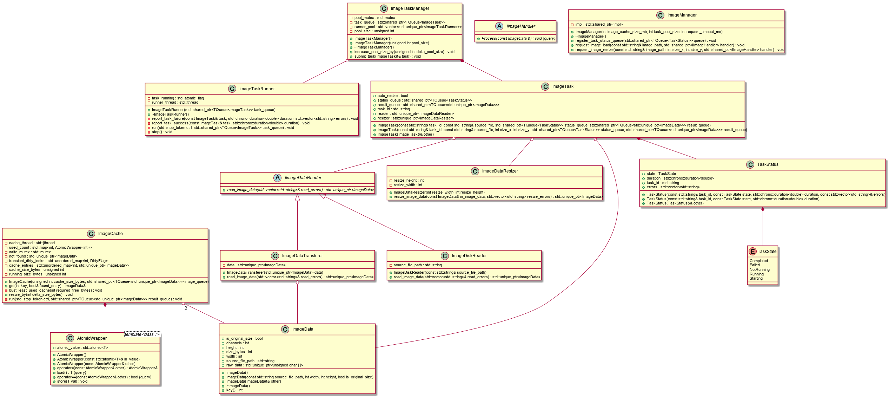

# Image tasker

# Overview



# Demo

Basic CLI demo app provided

```
Image Tasker Demo

image_tasker_demo.exe [OPTIONS]

OPTIONS:
  -h,     --help              Print this help message and exit
  -i TEXT                     Full path to a on-disk image to test
  -x INT                      Width of image to test
  -y INT                      Height of image to test
  -c INT                      Image cache size in MB
  -p INT                      Number of image tasks in pool
  -r INT                      Request timeout for images in ms
```

# Manual Setup

Tested on Windows compiling

- MSVC 194 using C++20
- vscode
- cmake
- conan

## Conan

Install [conan](https://conan.io/)

```
pip install conan
```

Setup profile for build system

```
conan profile detect --force
```

## Project

Install project depedencies

```
conan install . --output-folder=build --build=missing
```

Setup cmake

```
mkdir build
cmake -B build -S . -DCMAKE_PROJECT_TOP_LEVEL_INCLUDES=./build/conan_provider.cmake
```

# Build

```
cd build
cmake --build .
```

Run test

```
ctest --output-on-failure
```
